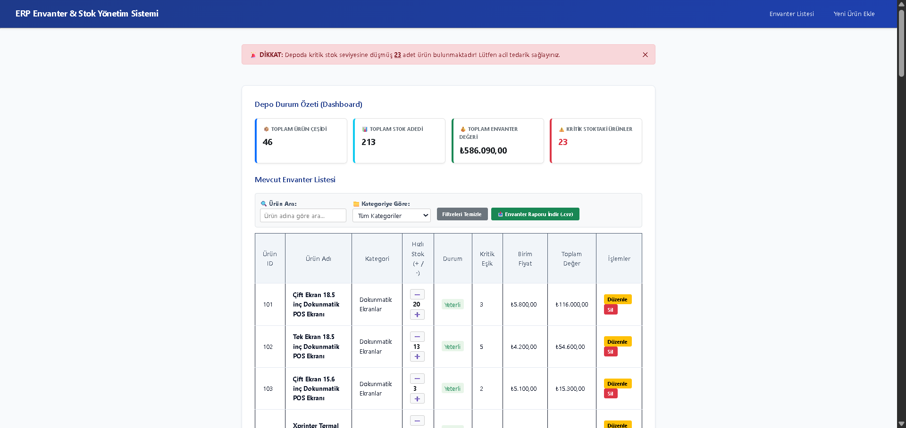
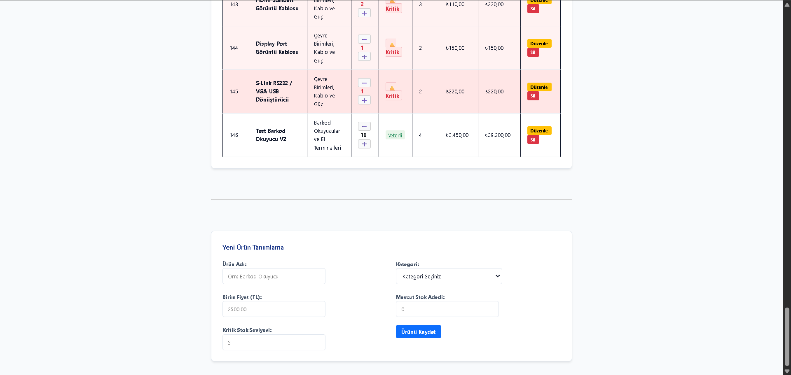

#  ERP Envanter ve Stok Yönetim Sistemi

ASP.NET Core Web API ve modern Vanilla JavaScript mimarisi kullanılarak geliştirilmiş; ilişkisel veritabanı desteğine sahip, dinamik gösterge paneli (dashboard) ve anlık kritik stok uyarı mekanizmaları barındıran kurumsal bir envanter yönetim platformudur.

---

## Uygulama Arayüzü

###  Gösterge Paneli ve Envanter Listesi


### Yeni Ürün Tanımlama ve İşlemler


---

##  Kullanılan Teknolojiler ve Mimari

* **Backend:** ASP.NET Core Web API, C#, Repository Pattern mimarisi
* **Frontend:** HTML5, CSS3, ES6+ JavaScript (Modüler yapı: `api.js`, `dom.js`, `app.js`)
* **Veritabanı:** Microsoft SQL Server (MSSQL), Stored Procedure & View desteği
* **Entegrasyon:** RESTful API, Fetch API, JSON, CORS yönetimi

---

##  Proje Dizin Yapısı

```text
ERP_Envater/
├── Database/               # Veritabanı kurulum scriptleri ve Full Backup
│   ├── envanter_kurulum.sql# Şema ve başlangıç verilerini içeren SQL betiği
│   └── EnvanterDB.bak      # MSSQL tam veritabanı yedeği (Full Backup)
├── ErpApi/                 # ASP.NET Core Web API backend servisleri
│   ├── Controllers/        # API uç noktaları
│   ├── Repositories/       # Veritabanı sorgu ve iş katmanı
│   └── Program.cs          # Bağımlılık enjeksiyonu ve servis konfigürasyonu
├── js/                     # Modüler JavaScript mimarisi
│   ├── api.js              # Backend HTTP istekleri (Fetch)
│   ├── dom.js              # Arayüz çizimi ve dinamik DOM yönetimi
│   └── app.js              # Olay dinleyicileri ve ana uygulama akışı
├── index.html              # Kullanıcı arayüzü ana sayfası
├── style.css               # Kurumsal arayüz stilleri
├── dashboard.png           # Arayüz tanıtım görseli
└── urun-ekle.png           # Form tanıtım görseli
